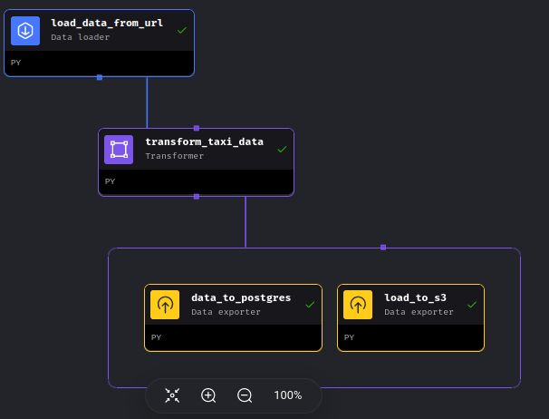
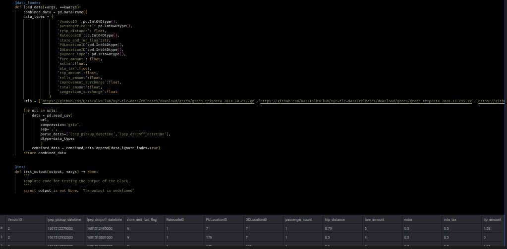
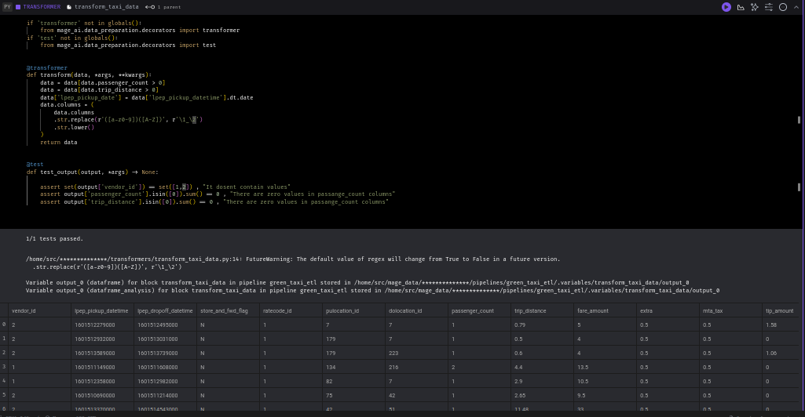
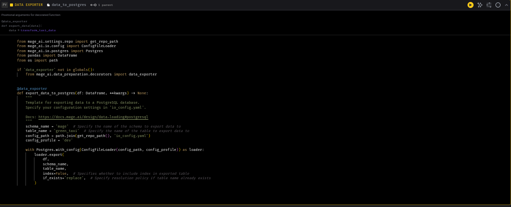
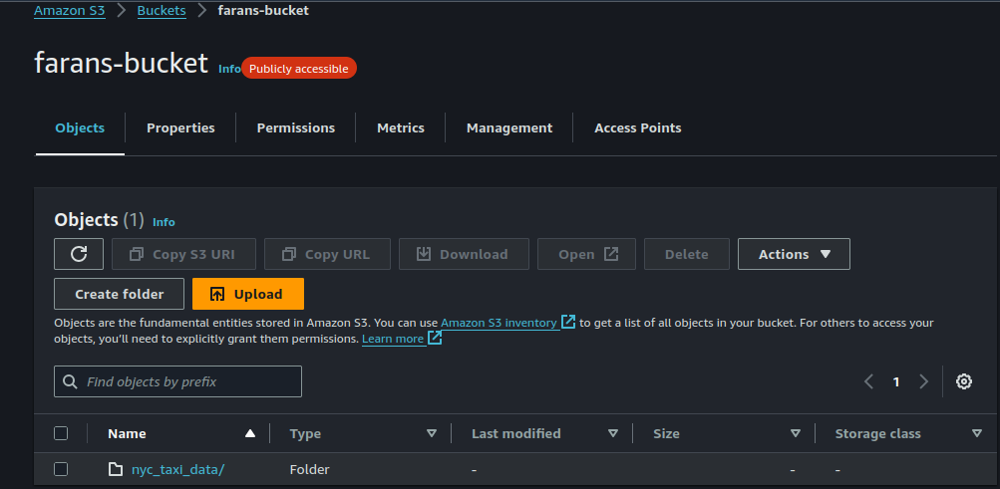
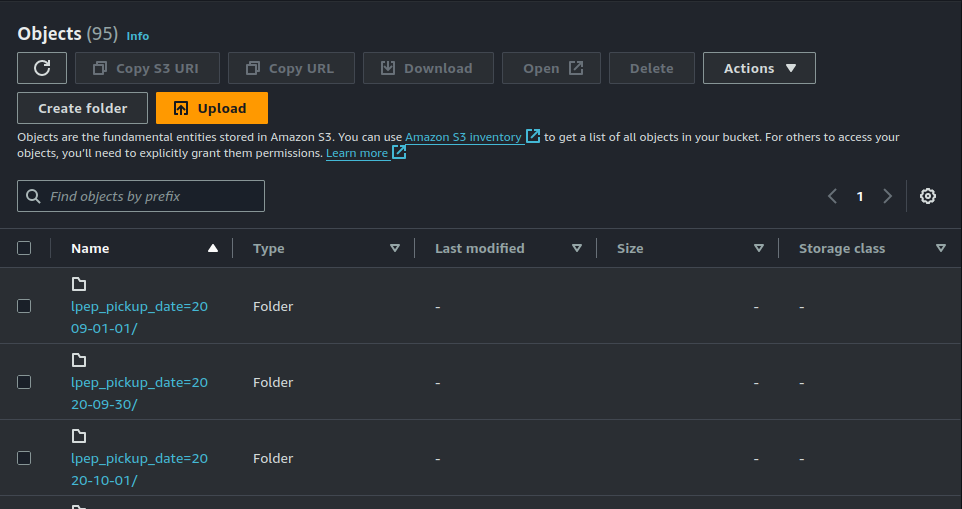
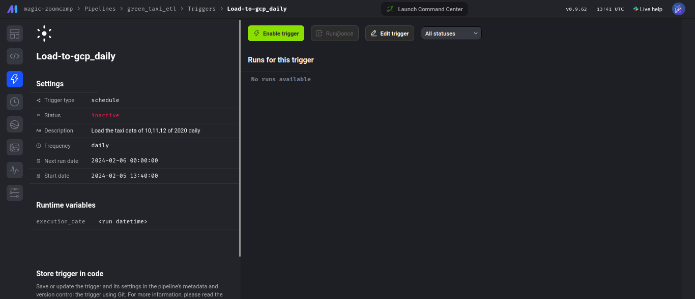

# Data_Engineering_Zoomcamp
My participation Repo for Data Engineering Zoomcamp

# Flow Diagram:

# Overall Pipeline in Mage:

# Fetched Data using Data Loader

# Transformed and Tested Data

# Loaded data to Postgres

# Loaded data to S3 

# Loaded data in partitions

# Added Trigger to run pipeline daily
 
